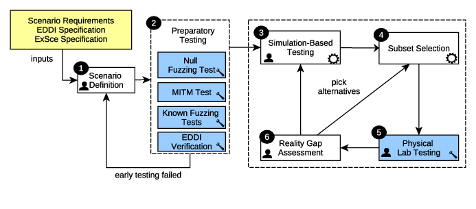

# SESAME Simulation-Based Testing Platform

This repository presents the installation guide and source code for
the SESAME simulation-based testing platform developed for the system.
The software, its design principles and rationale are described in the
SESAME deliverable documents

- D6.6: Simulation-Based Testing Methodology for EDDIs
- D6.7: Tools for Automated Quality Assurance of EDDI-Supported MRS

The integrated methodology:

The testing architecture:

# Documentation

Documentation and installation instructions for the platform can be found here:
[Documentation for the SESAME simulation-based testing platform](./documentation/index.md)

This online guide complements D6.7 in reference to providing
source code and instructions for the platform.
