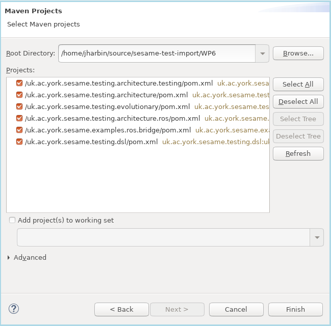
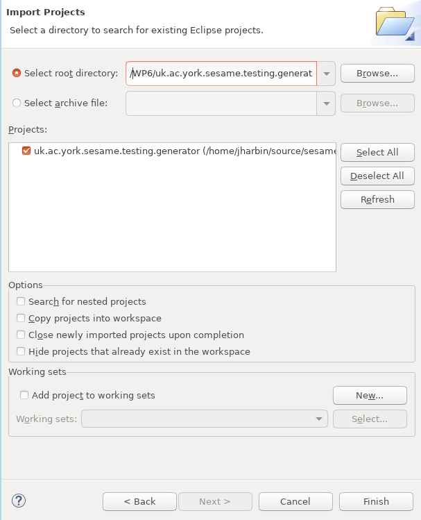

# Installing the testing platform for Linux

These instructions are designed for Ubuntu Linux (tested on Ubuntu
18.04 and 20.04), but may work on later Ubuntu releases:

## Installing dependencies of the platform:
Install the following packages by running these commands upon a terminal:
```
sudo apt-get install maven openjdk-11-jdk openjdk-11-jre procps
```

If using ROS use cases, install the following additional packages
(substitute VERSION for your ROS version):

```
apt-get install ros-VERSION-rosbridge-server
```

Download Apache Kafka - here using version 2.13-3.1.0 from https://kafka.apache.org/downloads

Install Kafka using the following commands:
```
mkdir -p ~/source/kafka && cd ~/source/kafka
mv ~/Downloads/kafka_2.13-3.1.0.tgz .
tar -xvzf kafka_2.13-3.1.0.tgz
```

## Cloning platform repository

```
mkdir ~/sesame && cd ~/sesame
git clone https://www.github.com/sesame-project/simulationBasedTesting
```

In this case, /home/USERNAME/sesame/simulationBasedTesting gives the
GITHUB_ROOT to be used in future steps

**If you are using the PAL use case, please use the "develop" branch**
```
git checkout develop
```

## Install Eclipse and Modelling Tools
### Install Eclipse
Install Eclipse (here using 2022-12) by using Eclipse Installer from eclipse.org

### Install Modelling Tools
- Start Eclipse
- Select “Help” / “Install New Software”
- Select the update link for your Eclipse version e.g. “Work With” - “2022-12 - **http://download.eclipse.org/releases/2022-12**
- Select “Modeling” and check all beneath it in the check box
- Select “Next” twice
- Accept the license
- Wait for install to complete (indicated on “Installing Software” on lower right status bar) - it may freeze at 49\% for a while
- Select “Restart” to apply updates

- Restart Eclipse
- Select “Help” / “Install New Software”
- Select the update site for Epsilon - **http://download.eclipse.org/epsilon/updates/2.4/**
- Install all items under ``Epsilon Core'' and ``Epsilon EMF Integration''

- Restart Eclipse
- Select “Help” / “Install New Software”
- Select the update site for Emfatic - **http://download.eclipse.org/emfatic/update/**

### Installing Simulation-Based Testing Framework Packages

- Then import the Maven projects using ``File'' / ``Import'' / ``Maven'' / ``Existing Maven Projects''.
- Select the GITHUB_ROOT (here /home/USERNAME/sesame/simulationBasedTesting) and the projects
  underneath it shown below:
- (If not using the TTS use case, close the TTS project to save having to generate its source

```
JGEA
jrosbridge
uk.ac.york.sesame.testing.architecture
uk.ac.york.sesame.testing.architecture.ros
uk.ac.york.sesame.testing.architecture.tts
uk.ac.york.sesame.testing.dsl
uk.ac.york.sesame.testing.evolutionary
```
- Then press ``Finish'':



- Import the generator project using ``File'' / ``Import'' / ``General'' / ``Existing Projects Into Workspace''.
- Select the GITHUB_ROOT (here /home/USERNAME/sesame/simulationBasedTesting) and the project **uk.ac.york.sesame.testing.generator** underneath it shown below:
- Then press ``Finish``:

### Source Generation (only if using the TTS use case)
- Generate sources for the TTS project **uk.ac.york.sesame.testing.architecture.tts**:
- Right-click on the TTS project and select "Generate Sources"



### Setting paths

- Set the REPO_BASE_PATH in the project **uk.ac.york.sesame.testing.evolutionary** and the file *utilities/PathDefinitions.java*:
- Set it to GITHUB_ROOT e.g. it you installed to "sesame" in your home directory, the line should read:
```
private static String REPO_BASE_PATH = "/home/USERNAME/sesame/simulationBasedTesting/"
```

- Also, set the REPO_BASE_PATH in the project **uk.ac.york.sesame.testing.generator** and the file *src/ModelPathDefinitions.java*:
- Set it to GITHUB_ROOT e.g. it you installed to "sesame" in your home directory, the line should read:
```
private static String REPO_BASE_PATH = "/home/USERNAME/sesame/simulationBasedTesting/"
```

### Install all the projects using Maven

- Maven Install all the projects in the Package Explorer in order below (skip TTS if not using this use case):
```
JGEA
jrosbridge
uk.ac.york.sesame.testing.architecture
uk.ac.york.sesame.testing.architecture.ros
uk.ac.york.sesame.testing.architecture.tts
uk.ac.york.sesame.testing.dsl
uk.ac.york.sesame.testing.evolutionary
```
- On case project, right-click "Run Configurations" / "Maven Install" (for some projects, you may need to retry this before it succeeds)

### Apache Kafka and Zookeeper

- Since the testing platform uses Apache Kafka and Zookeeper, these
  need to be started before running experiments:
- Open a new terminal and run the following:
```
cd ~/source/kafka/kafka_2.13-3.1.0
./bin/zookeeper-server-start.sh config/zookeeper.properties
```

- Wait for Zookeeper to start successfully (it takes 5-6 seconds)
- Open a second new terminal and run the following: 
```
cd ~/source/kafka/kafka_2.13-3.1.0
./bin/kafka-server-start.sh config/server.properties
```

# Additional instructions for TTS use case
[Additional instructions for TTS/KUKA use cases](./INSTALL-tts.md)

# Additional instructions for ROS use case - PAL etc
[Additional instructions for ROS use cases](./INSTALL-linux-ros.md)

# Troubleshooting
[See troubleshooting in case of problems with installation or usage](./TROUBLE.md)

