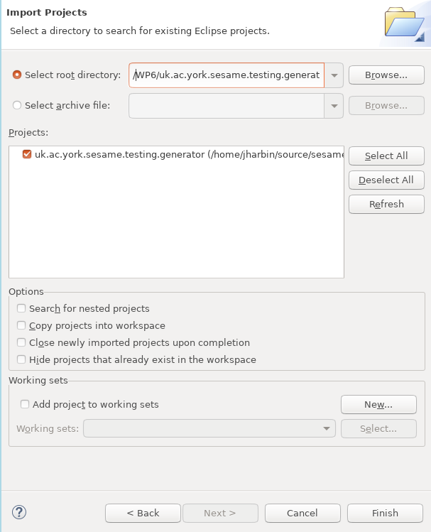

## Installing dependencies of the platform:

### Eclipse and Modelling Tools
- Start Eclipse
- Select “Help” / “Install New Software”
- Select the update link for your Eclipse version e.g. “Work With” - “2022-03 - \url{http://download.eclipse.org/releases/2022-03}”
- Select “Modeling” and check all beneath it in the check box
- Select “Next” twice
- Accept the license
- Wait for install to complete (indicated on “Installing Software” on lower right status bar) - it may freeze at 49\% for a while
- Select “Restart” to apply updates

- Restart Eclipse
- Select “Help” / “Install New Software”
- Select the update site for Epsilon - \url{http://download.eclipse.org/epsilon/updates/2.4/}
- Install all items under ``Epsilon Core'' and ``Epsilon EMF Integration''

- Restart Eclipse
- Select “Help” / “Install New Software”
- Select the update site for Emfatic - \url{http://download.eclipse.org/emfatic/update/}

### Apache Kafka and Zookeeper

- Since the testing platform uses Apache Kafka and Zookeeper, install their binaries to a local directory.
- Open a terminal, navigate to this base directory, run the command to execute zookeeper and coordinates Kafka brokers:\\
- Set up the platform contents

- /bin/zookeeper-server-start.sh config/zookeeper.properties$}
- Upon another terminal, after zookeeper has started successfully (it takes 5-6 seconds) start a Kafka server:\\
  \verb$./bin/kafka-server-start.sh config/server.properties$}

### Installing Simulation-Based Testing Framework Packages

- To install the Eclipse packages, firstly clone the current
  repository branch ``main'' to a directory on your system.

- Then import the Maven projects using ``File'' / ``Import'' / ``Maven'' / ``Existing Maven Projects''.

- Then select the repository and the directory ``simulationBasedTesting'' and all projects underneath it as shown below


- Then press ``Finish'':

- Import the generator project using ``File'' / ``Import'' / ``General'' / ``Existing Projects Into Workspace''.
- Select the directory ``WP6'' of the imported repository and the project directory ``uk.ac.york.sesame.testing.generator'' and select ``Finish''



### Setting paths

There are several paths in the generated runner which should be set before executing the generated experiment runner:
- spaceModelFilename: gives the full absolute path of the model filename (which is used in the wizard)
- CODE_GENERATION_DIRECTORY: the full base path of the project which should be used
- orchestratorBasePath: the full path of the generator project in the user's file system

In future work, we will have these file paths set up automatically, or configurable from a property file.

```
final String spaceModelFileName = "/home/jharbin/runtime-EclipseApplication/TestSesame/models/testingHealthcare.model";
final String CODE_GENERATION_DIRECTORY = "/home/jharbin/runtime-EclipseApplication/TestSesame";
final String orchestratorBasePath = "/home/jharbin/academic/sesame/WP6/uk.ac.york.sesame.testing.generator/";
```
