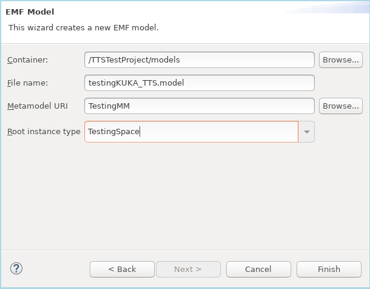

# User Guide
This document describes using the SESAME simulation-based testing platform.
It is assumed that at this point the users have already set up and
installed the platform. The user guide contains the following headings:

- Starting the Child Eclipse (in order to run the SESAME Wizard)
- Creating a new Project (to host the model, custom and generated code)
- Creating the model file
- Defining the MRS model
- Defining the Testing model
- Generating Code
- Implementing Custom Performance Metrics
- Executing Experiments 

## Starting Child Eclipse
In order to use the simulation-based testing platform, firstly, the
user should load Eclipse and then invoke a new Eclipse Application, by
right-clicking upon the project
**uk.ac.york.sesame.testing.generator** and selecting "Run As" /
"Eclipse Application". This will launch a fresh Eclipse instance under
which the SESAME automated code generation plugins are available:


(If there is a problem flagged regarding "javax.xml.bind", ignore
it). There may be a delay on the first invocation of this.

## Creating New Project

Create a new Java project - here, we use **TTSTestProject** Create a
folder "models" in it. (When creating the project, turn off "Create
module-info.java" at the bottom of the project dialog).

In order to generate a model for the first time in a newly created
project, it is necessary to register the metamodels. This can be done
by activating the early stage of our wizard, by right-clicking on
``SESAME'' / ``Generate SESAME Code'', as shown in the figure
below. Then, click Cancel on the dialog box that appears.


## Initial Model Creation
Next, create an instance of the testing metamodel. To do this, right
click on the folder "models" and select "New" / "Other" / "Epsilon" /
"EMF Model" and set up the parameters as shown below:



Use "Browse" to find "TestingMM" as the metamodel URI. The model
filename can be chosen to fit the scenario that the users are setting
up.

Now users can complete the steps specified in the SESAME
simulation-based testing methodology. When the model is completed, or
when there are any changes to the experiments, right click on the
project, and select "SESAME" / "Generate SESAME Code" to
regenerate code for metric templates and experiment runners based on
it.

After this code generation is performed for the first time, the
  project structure must be changed to a Maven project. Users should
  right-click on the project, select "Configure" / "Convert to Maven
  Project". Then the user should right-click and select "Maven" /
  "Update Project" to ensure all the dependencies are updated.

## Defining the Testing Model

The Testing model defines the testing process, and needs to be
specified in order to define the test campaign (experiment behaviour
and structure), the available fuzzing operations, and the performance
metrics. In addition, our testing platform provides a convenient
visual editor for system test engineers to configure the MRS structure
(a representation of the multi-robot system, its robots, system
variables and data types) during system testing experiments.

### Interactive Editing of the Testing Model
In order to define the model interactively, the Exceed editor can be
used to add classes in a hierarchical structure. The root element
TestingSpace is already included in the model, but right-clicking on
it will allow child elements of this model be added. The metamodel
constrains how elements are related to each other. Elements can have
children, and properties can be set for objects, according to the
permitted data types.

### Setting up MRS model
The information in the ExSce can be used to define an MRS model that
serves as an input to the testing platform. The information in this is
used to control the subscriptions to simulator variables, by
specifying information about their data types and the logical
structure of the system in terms of transmitting and receiving nodes.

A UML diagram of the MRS model is presented here:


To add the MRS as a child of the testing model, right-click upon the
TestingSpace and add a "New child" / "MRS". The users can then set in
the properties editor the "Launch File Location" (a shell script that
runs the chosen simulator), and "Launch Delay Seconds" - a time delay
to allow the MRS to start up before the platform attempts to connect
to it.

Then the user should add "New Child" / "Simulator" object, either ROS
or TTSSimulator, which configures the type of logical interface for
the platform to use and the launching method. The port property should
currently be 8089 for both simulators, typically the hostname should
be "localhost".

It is important for the MRS model to contain entries for simulator
variables and their associated data types, for every simulator
variable that the platform should subscribe to. Also, nodes should be
introduced to represent each robot or simulator component that should
be involved in fuzz testing, and the nodes set to transmit the
relevant simulator variable. The defined MRS variables are referenced
later when setting up the fuzzing operations in the testing model,
setting *variablesToAffect* (e.g., fuzzing operations are selected to
operate upon a particular variable).

Examples for the MRS model structure for both ROS and KUKA/TTS are
given below:

#### Example for ROS case study


#### Example for KUKA/TTS case study


The selected type of information and parsing method also alters the
internal operation of several fuzzing operations; for example,
selecting the JSON ParsingMethod when using ROS allows the use of
structured variables in fuzzing (extracting, for example, x and y
fields from a PoseStamped message). When accessing variables that
contain only a single numerical field, such as the joint values in the
KUKA/TTS case study, the STRING parsing method should be used. The raw
double values will be parsed as strings from the message within the
fuzzing operations, and interpreted as doubles.

### Setting up Testing Model
The metamodel for Testing is specified as UML here:


The TestingSpace class is the root element of the DSL, and contains
permissible fuzzing operations (under *possibleOperations*) that
collectively specify the boundaries of the potential fuzzing space
that can be explored. The fuzzing operations that can be applied to
the MRS in a particular fuzzing test are always a subset of these,
with potentially more specific parameters. 

A testing space also includes particular metrics which are used to
quantify the robotic system performance in regard to safety
violations, which allows multi-objective optimisation of system
performance to be performed. These metrics will be defined as Java
code, allowing users to define exactly how the system responds to
incoming messages from the MRS and processes them to produce the
metric values.

The user should name their testing space by double-clicking and
setting the value for the "Name" property in the Properties editor at
the bottom. The suggested value for a testing space name is
"fullSpace".

### Defining Fuzzing Operations

In order to define the types of fuzzing that can be permitted upon the
system, right-click on the TestingSpace in the editor and select "New
Child" to add Fuzzing Operations. The available fuzzing operations
will be indicated on the menu that appears.

This section describes particular fuzzing operations that can be
specified via the testing DSL. Each fuzzing operation involves a
manipulation of the simulator internal state, system communications,
or the resources available for simulation execution. The
FuzzingOperation class represents one specific fuzzing operation - an
entity which represents a specific strategy for making runtime
modifications or disruptions to the MRS. Subclasses of
FuzzingOperation are used to represent the specific semantics of this
fuzzing operation; for example, the PacketLossNetworkOperation class
represents a probabilistic loss of a proportion of packets. Currently,
*variableToAffect* should be set when setting up variable
subscriptions and defining the variables to which fuzzing operations
are applied.

The following fuzzing operations are available:


**BlackholeNetworkOperation**: This class defines a network fuzzing
operation which involves the disruption of message transmissions from
one node to another. When a blackhole fuzzing operation is active, all
transmissions on a particular simulator variable will be dropped by
the fuzzing engine, preventing the message from reaching its intended
destination(s). This fuzzing operation may correspond to realistic
simulation scenarios in which for example, a mistuned transmitter,
significant interference, or cabling with intermittent fault causes
the breakage of a communications link.

**PacketLossNetworkOperation**: This is a network fuzzing
operation which involves the disruption of message transmissions in a
similar manner to the blackhole fuzzing operation. However, the
primary difference between them is that the grayhole fuzzing operation
is probabilistic and performs a random test before discarding the
message. A configurable parameter is provided in the DSL which allows
the range of loss probabilities to be specified in the testing
space. A specific implementation of this, in a Test in a
TestingCampaign will have the lowerBound equal to the upperBound. This
value will be tested independently for every message passing through
the testing infrastructure in order to determine the probability of the
message being lost.

**RandomValueFromSetOperation**: This fuzz testing operation permits the
replacement of structured parameters within a message with newly
generated random values. For example, an MRS vehicle command velocity
can be replaced with randomised values, modelling a situation in which
a malfunctioning component or corrupted message leads to an incorrect
position data, in order to study the resulting effect upon
position. Alternatively, for a sensor used to detect humans in a
topology, randomised data can be introduced to the human orientation
angle in order to model a scenario in which an individual's location
is incorrectly detected.

The testing DSL permits a mechanism for the RandomValueFromSet fuzzing
operation to specify generic parameters for randomisation, allowing it
to be flexibly configured for novel variables and custom
scenarios. A RandomValueFromSetOperation can contain multiple
ValueSets, and each value set specifies the upper and lower valid
ranges of the parameter. In turn, the propertyName attribute specifies
which message component is altered by randomised fuzzing at runtime.

In order to provide scenario-specific functionality, custom fuzzing
operations can also be employed in order to provide additional
operations. These operations could, for example, alter calibration or
other configuration file entries during a pre-processing phase, as
well as perform arbitrary message transformations at runtime. 

The class **CustomFuzzingOperation** provides this functionality. The
name of the custom operation specifies a Java class which users
implement to define how the operation processes incoming MRS
messages. The CustomFuzzingOperation contains a set of user-specific
parameters; subclasses of ValueSet. These parameters define the state
for this specific operation; for example, if using a fuzzing operation
to amend a custom data structure, a StringSets can quantify which
point, or its filesystem paths. PointRange can be used to define a
range of points to be used as an offset, which will be reduced to
specify specific values during the evolutionary process.

### Test Campaigns and Performed Test Results
The TestCampaign class specifies an experiment that can be performed
and sets parameters for a specific fuzzing experiment. A TestCampaign
references a choice of particular metrics to use in evaluating that
campaign. The includedOperations reference list allows the selection
of particular operations in order to constrain an experiment, by
allowing a system test engineer to choose interesting or relevant
operations.

Under a TestCampaign, the TestGenerationApproach selection allows the
user to specify the parameters for an experiment by selecting one of
several subclasses. For example, including NSGAEvolutionaryAlgorithm
allows an evolutionary experiment with the NSGA-II algorithm, and
contains specific parameters relevant to this approach, e.g., the
number of iterations and the population size. In this case, the
evolutionary algorithm is concerned with maximising violations of the
intended result metrics, and does not specifically track the coverage
obtained.

We also provide a new coverage-aware GA NSGACoverageWithCells, which
seeks to improve coverage of the space of potential fuzzing
tests. Further, RepeatedRunner provides support for repeated execution
of a particular selected test a number of times. The utility of this
is to allow an interesting test with a high reality gap or other
performance issues to be repeated and the reasons for its behaviour
investigated in depth.

Regardless of the test generation approach selected, the
performedTests attribute is populated during the execution of
experiments, containing the particular Tests generated and executed
for that campaign. The *resultSets* attribute is also populated
as the experiments proceed and finalised upon their completion,
containing references to the population of results upon a Pareto
front. This is an important feature that enables keeping track of the
history of evolved tests during simulation-based testing.

The Test class represents one test configuration that can be applied
to the MRS, corresponding to a particular selection of operations, and
the recorded history of evaluation of performance metrics. The latter
are represented by the containment of MetricInstances, which record
performance metrics for the results of evaluation of that particular
Test. During execution of the Test, the metric instances will be
recorded and stored within the model. This provides a record of the
impact of the fuzzing performed. 

### Example Testing Campaign Model

An example testing campaign model is given here:


## Generating Code 
After having defined the testing model, code generation can be used to
generate metric templates automatically, within the newly generated
project under the child Eclipse instance. The testing platform
provides a plugin consisting of a wizard with a single page, which can
be accessed by right-clicking on the user’s newly generated project
and selecting "Generate SESAME Code":


The plugin provides an interface option to select the file containing
the user's populated model, and associated settings. Here we choose the
model file and the locations of other items for the project. The
annotations in red upon the screenshot show the values selected for
the text boxes:


## Implementing Custom Performance Metrics
The next step involves the user specifying scenario-specific
performance metrics for the metrics generated in the model, in order
to quantify violations of mission requirements. In order to implement
these metrics, the user first needs to copy these classes from package
**metrics.generated** into a newly package **metrics.custom**. Then,
it is necessary to implement the needed platform-specific metrics as
Java code. The figure below presents the key method processElement1 of
the implementation of the *collisionOccurrence* metric used in the
KUKA/TTS use case, to quantify violations by tracking the number of
intervals in which collisions of the gripper safety zone with any
safety zone.

```
public void processElement1(EventMessage msg, Context ctx, Collector<Double> out)  {
    String completionTopicName = "safetyzone";
    String topic = msg.getTopic();
    if (topic.contains(completionTopicName) && topicMatches(topic)) {
        if (msg.getValue() instanceof String) {
            String s = (String) msg.getValue();
            Optional<ROSMessage> rosmsg_o = ROSMessageConversion.fromJsonString(s);
            if (rosmsg_o.isPresent()) {
                ROSMessage rosmsg = rosmsg_o.get();
                SafetyZone sv = rosmsg.getSafetyZone();
                float level = sv.getLevel();

                if (violationCount.value() == null) {
                    violationCount.update(0L);
                }

                if (level < getLevelThreshold() && isReadyToLogNow()) {
                    violationCount.update(violationCount.value() + 1);
                    out.collect(Double.valueOf(violationCount.value()));
                }
            }
        }
    }
}
```

The metric operates as follows:

If the region surrounding the robot gripper (green sphere) collides
with these regions, the collision detection logic will trigger a
safety zone message which will be sent to the testing platform via the
TTSSimulator custom API over gRPC.  As an inbound simulator event,
these will then trigger the processElement1 method of the metric.  If
the message inbound topic is a safety zone message of sufficient
depth, then the violationCount$ variable will be incremented.  This
value is emitted as the output value.  The final $violationCount$
value will be logged as the output of the metric.

### Starting Dockers (Windows Only)
If using the testing platform on Windows, these steps will have to be
performed every time you wish to use the testing platform.

Start the Docker Desktop GUI application console.

To start the Dockers, in the first Cygwin terminal, run:
```
cd ~/docker-yaml/kafka-stack-docker-compose
docker-compose -f zk-single-kafka-single.yml up -d
```

In the second Cygwin terminal, wait one minute or so, and then run:
```
cd ~/docker-yaml/kafka-stack-docker-compose
docker-compose -f zk-single-kafka-single.yml ps
```

Two containers (Kafka and Zookeeper) should be running correctly.
Sometimes, especially on first reboot, they will not start correctly,
or will shut down after the first minute, but will normally run
properly at the second attempt. If one of them is listed as not
running, restart them by running in the first terminal:

```
cd ~/docker-yaml/kafka-stack-docker-compose
docker-compose -f zk-single-kafka-single.yml down
docker-compose -f zk-single-kafka-single.yml up -d
```

## Executing The Experiments
The user should create an Eclipse Run Configuration for the generated
Java class **ExptRunner\_NAME.java** for the name corresponding to the
name of the run configuration they have in the DSL. would like to
execute, and invoke this Run Configuration in order to run the
experiment.  This runner will be configured with the parameters chosen
from the Testing DSL.  If any parameters of the experiment in the
model are changed, users should rerun ``Generate SESAME Code'' with
the wizard, to ensure the experiment runner settings are updated.

The experiment runner will generate tests according to the strategy
specified for the experiement's test campaign.  Its
TestGenerationApproach selection allows the user to specify the
parameters for an experiment by setting one of several subclasses.
For example, including **NSGAEvolutionaryAlgorithm** allows an
evolutionary experiment with the NSGA-II algorithm, and contains
specific parameters relevant to this approach, e.g., the number of
iterations and the population size.  We also provide a new
coverage-aware GA **NSGACoverageWithCells**, which seeks to improve
coverage of the space of potential fuzzing tests.  Further,
**RepeatedRunner** provides support for repeated execution of a
particular selected test a number of times.  The utility of this is to
allow an interesting test with a high reality gap or other performance
issues to be repeated and the reasons for its behaviour to be
investigated in depth.

Regardless of the test generation strategy selected, the
*performedTests* attribute is populated during the execution of
experiments, containing the particular Tests generated and executed
for that campaign.  Each test is evaluated by first dynamically
generating a specialised test runner which acts as a middleware
interfacing with the low-level MRS simulation and modifying its
internal messages, using any custom-supplied metric definitions
provided to quantify the impact of the fuzzing test.  The
*resultSets* attribute is also populated as the experiments
proceed and finalised upon their completion, containing references to
the population of results upon a Pareto front.  This is an important
feature that enables keeping track of the history of evolved tests
during simulation-based testing.

The output results (both the individual Tests and the result sets
generated), can be browsed with the Exceed editor. A fragment of the
an output result set s is shown here:


This shows some result sets from an experiment, with the population of
a front at an intermediate generation. The results in the result set
are shown here. Using the Exceed editor the tests comprising this
result set are be displyed. Also, using a provided EGL script under
**uk.ac.york.sesame.testing.generator** at
**files/resultsAnalysis/resultsAnalysis.egl** allows the results and
output metrics to be listed in the Eclipse console window.

# Troubleshooting

## Ensuring Kafka is started
If there are problems when the simulation, i.e. if messages do not
appear to flow and robots remain entirely static, it is possible that
Kafka is not transmitting messages properly. Check that both Docker
containers started properly via the following commands run in a Cygwin terminal:
```
cd ~/docker-yaml/kafka-stack-docker-compose
docker-compose -f zk-single-kafka-single.yml ps
```

## Project Errors on Loading Eclipse
When loading Eclipse, errors may occasionally appear in the
**uk.ac.york.sesame.testing.architecture.tts** project. If that
happens, right click on this project, select "Run Configurations",
"Maven Clean" then "Maven Generate Sources".

## Model Debugging
If there are problems with the model or code generation:

- Ensure that there is a metric code Java class properly defined under
  package **metrics.custom**, for the name of the metric in the
  Testing DSL appended with "Metric.java". So for example, with a
  metric name MinimalDistance, the metric file should be
  MinimalDistanceMetric.java. This may e.g. happen if you rename the
  metric after generating the code via the SESAME Wizard.

- Ensure that all fuzzing operations have an activation timing and
  appropriate properties properly defined. Selecting "Validate" by
  right-clicking on the model in the Exceed editor may help to spot
  errors here.

- If metric values are not appearing properly, check log files for the
  individual tests simulation under the following path:
  **C:\cygwin64\home\USERNAME\academic\sesame\WP6\uk.ac.york.sesame.testing.evolutionary\scripts**
  The files will be named Test_XYZ\___.err. It is normal for an
  exception to be logged at the end, but no Java internal exceptions
  or the. This may be caused by errors in the metric, or in gRPC
  communications.
  
- Timeouts before starting the simulation may need to be increased
  under "TTSSimulator" in the MRS model
  
- The individual tests can be debugged by finding the Java source
  files for the generated test runners e.g. Test_XYZ\..._.java, and
  creating new Run/Debug Configurations to execute them.
  
