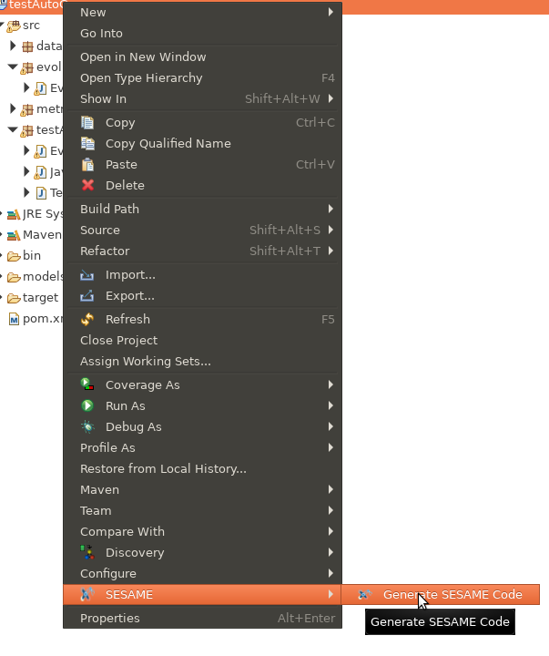

# User Guide

## Starting Child Eclipse
In order to use the simulation-based testing platform, firstly, the
user should load Eclipse and then invoke a new Eclipse Application, by
right-clicking upon the project
**uk.ac.york.sesame.testing.generator** and selecting *Run As* /
*Eclipse Application*. This will launch a fresh Eclipse instance
under which the SESAME automated code generation plugins are available
(Figure \ref{FIG-RUN-GENERATOR-PROJECT}). (If there is a problem
flagged regarding ``javax.xml.bind'', ignore it). There may be a delay
on the first invocation of this.

## Creating New Project

Create a new Java project - here, we use **TTSTestProject** Create a
folder ``models'' in it. When creating the project, turn off ``Create
module-info.java'' at the bottom of the project dialog.

In order to generate a model for the first time in a newly created
project, it is necessary to register the metamodels. This can be done
by activating the early stage of our wizard, by right-clicking on
``SESAME'' / ``Generate SESAME Code'', as shown in the figure
below. Then, click Cancel on the dialog box that appears.

## Initial Model Creation
Next, create an instance of the testing metamodel. To do this, right
click on the folder ``models'' and select ``New'' / ``Other'' /
``Epsilon'' / ``EMF Model'' and set up the parameters as shown in
Figure~\ref{FIG-NEW-MODEL-GENERATION}. Use ``Browse'' to find
``TestingMM'' as the metamodel URI. The model filename can be chosen
to fit the scenario that the users are setting up.

Now users can complete the steps specified in the SESAME
simulation-based testing methodology. When the model is completed, or
when there are any changes to the experiments, right click on the
project, and select ``SESAME'' / ``Generate SESAME Code'' to
regenerate code for metric templates and experiment runners based on
it (Figure \ref{FIG-SESAME-WIZARD}).

\jrhchanged{After this code generation is performed for the first
  time, the project structure must be changed to a Maven
  project. Users should right-click on the project, select
  ``Configure'' / ``Convert to Maven Project''. Then the user should
  right-click and select ``Maven'' / ``Update Project'' to ensure all
  the dependencies are updated.}

## Defining the Testing Model

The Testing model defines the testing process, and needs to be
specified in order to define the test campaign (experiment behaviour
and structure), the available fuzzing operations, and the performance
metrics. In addition, our testing platform provides a convenient
visual editor for system test engineers to configure the MRS during
system testing experiments.

The metamodel for Testing is specified here:

The TestingSpace class is the root element of the DSL, and contains
permissible fuzzing operations (under *possibleOperations*) that
collectively specify the boundaries of the potential fuzzing space
that can be explored. The fuzzing operations that can be applied to
the MRS in a particular fuzzing test are always a subset of
these, with potentially more specific parameters. 

### Test Campaigns and Performed Test Results
The testing space also includes particular metrics which are used to
quantify the robotic system performance in regard to safety
violations, which allows multi-objective optimisation of system
performance to be performed. References to a grammar are reserved to
specify a grammar for custom fuzzing conditions, that control the
activation and deactivation of particular fuzzing operations.

The TestCampaign class specifies an experiment that can be performed
and sets parameters for a specific fuzzing experiment. A TestCampaign
references a choice of particular metrics to use in evaluating that
campaign. The includedOperations reference list allows the selection
of particular operations in order to constrain an experiment, by
allowing a system test engineer to choose interesting or relevant
operations. 

Under a TestCampaign, the TestGenerationApproach selection allows the
user to specify the parameters for an experiment by selecting one of
several subclasses. For example, including NSGAEvolutionaryAlgorithm
allows an evolutionary experiment with the NSGA-II
algorithm, and contains specific parameters
relevant to this approach, e.g., the number of iterations and the
population size. In this case, the evolutionary algorithm is concerned
with maximising violations of the intended result metrics, and does
not specifically track the coverage obtained. 

We also provide a new coverage-aware GA NSGACoverageWithCells, which
seeks to improve coverage of the space of potential fuzzing
tests. Further, RepeatedRunner provides support for repeated execution
of a particular selected test a number of times. The utility of this
is to allow an interesting test with a high reality gap or other
performance issues to be repeated and the reasons for its behaviour
investigated in depth. 

Regardless of the test generation approach selected, the
performedTests attribute is populated during the execution of
experiments, containing the particular Tests generated and executed
for that campaign. The *resultSets* attribute is also populated
as the experiments proceed and finalised upon their completion,
containing references to the population of results upon a Pareto
front. This is an important feature that enables keeping track of the
history of evolved tests during simulation-based testing.

The Test class represents one test configuration that can be applied
to the MRS, corresponding to a particular selection of operations, and
the recorded history of evaluation of performance metrics. The latter
are represented by the containment of MetricInstances, which record
performance metrics for the results of evaluation of that particular
Test. During execution of the Test, the metric instances will be
recorded and stored within the model. This provides a record of the
impact of the fuzzing performed. 

### Defining Fuzzing Operations
This section describes particular fuzzing operations that can be
specified via the testing DSL. Each fuzzing operation involves a
manipulation of the simulator internal state, system communications,
or the resources available for simulation execution. The
FuzzingOperation class represents one specific fuzzing operation - an
entity which represents a specific strategy for making runtime
modifications or disruptions to the MRS. Subclasses of
FuzzingOperation are used to represent the specific semantics of this
fuzzing operation; for example, the PacketLossNetworkOperation class
represents a probabilistic loss of a proportion of packets. Currently,
*variableToAffect* should be set when setting up variable
subscriptions and defining the variables to which fuzzing operations
are applied.

The following fuzzing operations are available:

**BlackholeNetworkOperation**: This class defines a network fuzzing
operation which involves the disruption of message transmissions from
one node to another. When a blackhole fuzzing operation is active, all
transmissions on a particular simulator variable will be dropped by
the fuzzing engine, preventing the message from reaching its intended
destination(s). This fuzzing operation may correspond to realistic
simulation scenarios in which for example, a mistuned transmitter,
significant interference, or cabling with intermittent fault causes
the breakage of a communications link.

**PacketLossNetworkOperation**: This is a network fuzzing
operation which involves the disruption of message transmissions in a
similar manner to the blackhole fuzzing operation. However, the
primary difference between them is that the grayhole fuzzing operation
is probabilistic and performs a random test before discarding the
message. A configurable parameter is provided in the DSL which allows
the range of loss probabilities to be specified in the testing
space. A specific implementation of this, in a Test in a
TestingCampaign will have the lowerBound equal to the upperBound. This
value will be tested independently for every message passing through
the testing infrastructure in order to determine the probability of the
message being lost.

**RandomValueFromSetOperation**: This fuzz testing operation permits the
replacement of structured parameters within a message with newly
generated random values. For example, an MRS vehicle command velocity
can be replaced with randomised values, modelling a situation in which
a malfunctioning component or corrupted message leads to an incorrect
position data, in order to study the resulting effect upon
position. Alternatively, for a sensor used to detect humans in a
topology, randomised data can be introduced to the human orientation
angle in order to model a scenario in which an individual's location
is incorrectly detected.

The testing DSL permits a mechanism for the RandomValueFromSet fuzzing
operation to specify generic parameters for randomisation, allowing it
to be flexibly configured for novel variables and custom
scenarios. A RandomValueFromSetOperation can contain multiple
ValueSets, and each value set specifies the upper and lower valid
ranges of the parameter. In turn, the propertyName attribute specifies
which message component is altered by randomised fuzzing at runtime.

In order to provide scenario-specific functionality, custom fuzzing
operations can also be employed in order to provide additional
operations. These operations could, for example, alter calibration or
other configuration file entries during a pre-processing phase, as
well as perform arbitrary message transformations at runtime. 

The class **CustomFuzzingOperation** provides this functionality. The
name of the custom operation specifies a Java class which users
implement to define how the operation processes incoming MRS
messages. The CustomFuzzingOperation contains a set of user-specific
parameters; subclasses of ValueSet. These parameters define the state
for this specific operation; for example, if using a fuzzing operation
to amend a custom data structure, a StringSets can quantify which
point, or its filesystem paths. PointRange can be used to define a
range of points to be used as an offset, which will be reduced to
specify specific values during the evolutionary process.

## Setting up MRS model
The information in the ExSce is used to define an MRS model that
serves as an input to the testing platform.  The information in this
is used to control the subscriptions to simulator variables, by
specifying information about their data types and the logical
structure of the system in terms of transmitting and receiving
nodes. The selected type of information and parsing method also alters
the internal operation of several fuzzing operations; for example,
selecting the JSON ParsingMethod when using ROS allows the use of
structured variables, while within raw variables, the STRING parsing
method should be used.  These MRS variables are referenced when
specifying the testing model *variablesToAffect* (e.g., fuzzing
operations are selected to operate upon a particular variable).  A UML
diagram of the MRS model is provided in Figure 

[The MRS model used to define the multi-robot system](./readme-images/testing-metamodel-attacks-uml.png)

### Example for ROS case study

### Example for KUKA/TTS case study
